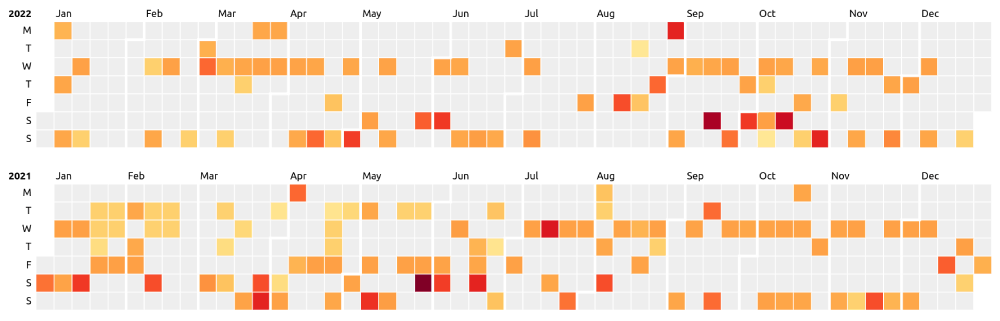

# [CubeTrek](https://cubetrek.com)

Topography is what makes Skiing, Hiking, Trail running and Mountain biking so exciting. You conquer those vertical distances with a lot of sweat and effort, but your tracking software only shows a boring 2D map.
That's where **CubeTrek** comes in.

Sign up on [CubeTrek.com](https://cubetrek.com), connect your Garmin and Polar watch and manage your outdoor activities.

## Features
Check out the examples on [CubeTrek.com](https://cubetrek.com); e.g. [SkiMo to the Mattijsch Horn](https://cubetrek.com/view/4967)

<video src="https://github.com/r-follador/CubeTrek/assets/3812273/c2f175b4-dbcb-4ade-aca7-a2ffc3bb2c8b"></video>
Interactive 3D Topology view using Babylon.js

<video src="https://github.com/r-follador/CubeTrek/assets/3812273/f3125863-cf29-4117-b282-08d551ae0c10"></video>
TrekMapper: Heatmap of all your activities in one map

<video src="https://github.com/r-follador/CubeTrek/assets/3812273/2cb06b85-8b51-413c-bffd-85c8a5c00b47"></video>
Tons of statistics

Github inspired activity stats

Automatic matching and comparing of similar activities.

## Tech Stack
The Back End is constructed with Java and Spring Boot backed with Postgresql (and Postgis), the Front End is based on Bootstrap. Good old plain JavaScript is used for interaction with the server.

The actual 3D magic is performed by the awesome Babylon.js library (check it out, if you've never heard of it), the graph is handled by D3.js (very versatile, but a steep learning curve), the 2D map is rendered with MapLibre GL JS (which is very straightforward to use in this particular case).

So here's what happens when you upload a FIT or GPX file: the server reads the tracks, downsamples them to a reasonable resolution and calculates some descriptive values (such as the geographical bounding box, distance, time, etc.).
The elevation data is cross-checked with the elevation model on the server. This is done to check if the device's height sensors were propely calibrated and a simple correction is applied if necessary. If elevation data is completely absent in the file (because the recording device doesn't have a height sensor) the elevation data is interpolated completely from the model.
The elevation model consists of HGT files retrieved from the NASA SRTM dataset.

To guess the activity name, we take the highest point in the track data (making the assumption that this is the most prominent point of the whole activity, e.g. the summit). This is cross-checked against a peak database on the server. The data comes from OpenStreetMap and contains all OSM features annotated as 'Peak', and contains >520k entries.
If there's no peak in the vicinity, a reverse geocoding request is sent to Maptiler.

Once all the data is gathered, it's stored in a PostGIS extended PostgreSQL database and the activity is ready be to put on the spotlight.

When you view the activity in the 3D viewer: the server provides two key files for each activity. An extended GeoJSON file, describing the track latitude/longitude data, time, and elevation data. A gLTF file which contains the 3D Model of the topography. Babylon.js is used to display the gLTF file and loads the texture (map tiles) from Maptiler.
A custom script than draws the track on top of the texture of the 3D model.
The script also handles the D3.js graph data conversion from the GeoJSON file, the mouse interaction etc.
The 2D map is very straightforward: just show the GeoJSON data in a MapLibre map (again using Maptiler as source for the map data).

When you view your heatmap (TrekMapper): The server provides a list of the center coordinates for every track associated to your account, which in turn is rendered by MapLibre GL JS to a heatmap. See MapLibre's Heatmap example for details.
In high zoom levels, the script requests a simplified GeoJSON for each track within the view, which are displayed in their own layer. Simplified means that the track resolution is downsampled quite significantly and no further information (i.e. no altitude data) is provided.
This makes the number of displayed coordinates on the user device more manageable, with the downside of noticeably simplified tracks when completely zoomed in.
After clicking on the map, Turf.js is used to determine the closest track. 

## Data sources
- Elevation model (HGT files): [NASA SRTM dataset](https://lpdaac.usgs.gov/products/srtmgl1v003/)
- Peaks and Saddles annotation: [Open Street Map](https://www.openstreetmap.org/), downloaded from [Geofabrik](http://download.geofabrik.de/) and filtered/converted/imported to PostgreSQL with [Imposm3](https://github.com/omniscale/imposm3)
- Maps: [Maptiler](https://www.maptiler.com/)

## Libraries
- All the GPS file handling and 3D file conversion: [TopoLibrary](https://github.com/r-follador/TopoLibrary)
  - Partially based on [JPX](https://github.com/jenetics/jpx) for reading GPS tracks and [Garmin FIT SDK](https://developer.garmin.com/fit/overview/) for reading FIT files
- Mapping: [MapLibre GL JS](https://maplibre.org/)
  - also: [Turf.js](https://turfjs.org/)
- Data visualization: [D3.js](https://d3js.org/)
- 3D visualization: [Babylon.js](https://www.babylonjs.com/)

## Contribute
- Pull requests are welcome! CubeTrek is licensed under GPLv2.0
- Consider becoming a Supporter of CubeTrek by getting a [subscription](https://cubetrek.com/subscribe). This helps paying the bills.